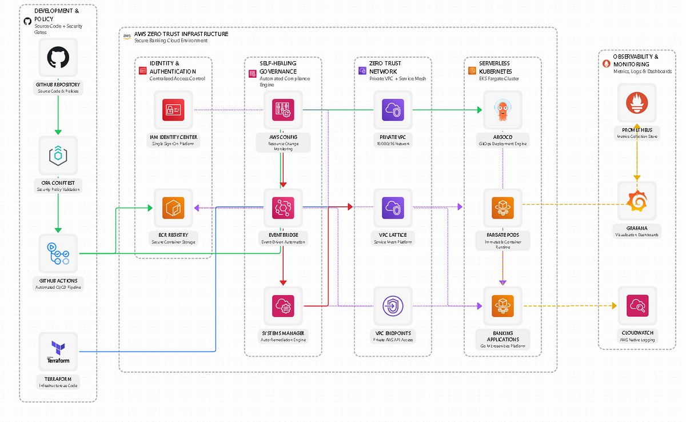

# Imladris: Zero Trust AWS Platform

[](https://github.com/ZEZE1020/imladris-project/actions/workflows/terraform-ci.yml)
[](https://www.terraform.io/)
[](https://aws.amazon.com/)
[](LICENSE)

A Zero Trust AWS environment for financial services. Implements private networking, policy-as-code governance, and automated security remediation.

---

## Overview

**Imladris** provides a secure, compliant AWS environment with:

- **Zero Trust Networking** — Private subnets only, no internet gateway, VPC endpoints for AWS services
- **Serverless Compute** — EKS Fargate exclusively, no EC2 instances to patch
- **Policy-as-Code** — OPA/Rego policies validated before deployment
- **Auto-Remediation** — AWS Config detects violations, EventBridge + Lambda fix them automatically
- **Identity-Based Access** — IAM Identity Center with role-based permissions

---

## Architecture


```
┌─────────────────────────────────────────────────────────────────────────────┐
│                           AWS ACCOUNT                                        │
│                                                                              │
│   Developer → GitHub → Policy Gate → Terraform → AWS → EKS → Service        │
│                          (OPA)        (IaC)     (Infra) (Fargate)           │
│                                                                              │
├──────────────┬──────────────┬──────────────┬────────────────────────────────┤
│  GOVERNANCE  │  NETWORKING  │   COMPUTE    │         SECURITY               │
├──────────────┼──────────────┼──────────────┼────────────────────────────────┤
│  OPA/Rego    │  VPC Lattice │  EKS Fargate │  AWS Config (6 rules)          │
│  Conftest    │  Private VPC │  No EC2      │  EventBridge + Lambda          │
│  Checkov     │  No IGW      │  KMS Encrypt │  SSM Auto-Remediation          │
│  Trivy       │  VPC Endpts  │  IAM IRSA    │  Identity Center (5 users)     │
└──────────────┴──────────────┴──────────────┴────────────────────────────────┘
```

### Network Design

- **VPC**: 10.0.0.0/16 with private subnets only
- **No Internet Gateway** — workloads access AWS services via VPC Endpoints
- **VPC Lattice** — service mesh with IAM authentication
- **VPC Endpoints**: S3, ECR (API + DKR), EKS, CloudWatch

---

## Repository Structure

```
imladris-project/
├── imladris-platform/          # Terraform infrastructure
│   ├── main.tf                 # Root module
│   └── modules/
│       ├── networking/         # VPC, Lattice, Endpoints
│       ├── compute/            # EKS Fargate, IAM Identity Center
│       └── governance/         # Config rules, EventBridge, Lambda
│
├── imladris-governance/        # OPA policies
│   └── policies/terraform/     # Terraform plan validation
│
├── imladris-gitops/            # ArgoCD configuration
│   ├── bootstrap/              # App-of-apps
│   └── tenants/banking-core/   # Sample application
│
├── imladris-service-template/  # Go service starter
│
├── lambda/                     # Remediation functions
│
└── k8s/tetragon-policies/      # Runtime security (eBPF)
```

---

## Quick Start

### Prerequisites

- Terraform >= 1.6
- AWS CLI >= 2.0
- kubectl >= 1.28
- AWS account with IAM Identity Center enabled

### Deploy

```bash
git clone https://github.com/ZEZE1020/imladris-project.git
cd imladris-project/imladris-platform

cp terraform.tfvars.example terraform.tfvars
# Edit terraform.tfvars with your values

terraform init
terraform plan
terraform apply

aws eks update-kubeconfig --region us-east-1 --name imladris-demo-cluster
```

### Validate Policies Locally

```bash
cd imladris-platform
terraform plan -out=tfplan
terraform show -json tfplan > tfplan.json
conftest test tfplan.json -p ../imladris-governance/policies/terraform/
```

---

## CI/CD Pipeline

GitHub Actions runs on every push/PR:

| Job | Tool | Purpose |
|-----|------|---------|
| Validate | Terraform | Format check, syntax validation |
| Security | Trivy | Infrastructure security scanning |
| Compliance | Checkov | CIS, SOC2, PCI compliance checks |
| Policy | Conftest | OPA policy validation (requires AWS creds) |

---

## Security Controls

### AWS Config Rules

| Rule | Description |
|------|-------------|
| restricted-ssh | Block SSH (port 22) from 0.0.0.0/0 |
| s3-bucket-public-read-prohibited | No public S3 buckets |
| eks-endpoint-no-public-access | EKS API must be private |
| root-access-key-check | No root account access keys |

### Auto-Remediation

```
Violation Detected → AWS Config → EventBridge → Lambda/SSM → Fixed
```

Example: SSH rule opened to 0.0.0.0/0 is automatically revoked within minutes.

---

## IAM Identity Center Users

| User | Role | Access |
|------|------|--------|
| sarah.finops | FinOps Analyst | Cost Explorer, Budgets (read-only) |
| alex.devops | Senior DevOps | Full EKS, ECR, networking |
| jamie.devops | Junior DevOps | EKS read, ECR push |
| mike.dev | Backend Developer | ECR, CloudWatch, limited EKS |
| lisa.dev | Frontend Developer | ECR, CloudWatch, S3 static |

---

## Cost Estimate

| Service | Monthly Cost |
|---------|-------------|
| EKS Control Plane | $73 |
| Fargate (minimal) | ~$30 |
| VPC Endpoints (4) | ~$30 |
| VPC Lattice | ~$10 |
| Config + CloudWatch | ~$15 |
| **Total** | **~$160/month** |

For demos: deploy, screenshot, destroy = ~$2-5

---

## Documentation

- [Setup Guide](docs/setup/SETUP.md)
- [AWS Configuration](docs/setup/AWS-SETUP-GUIDE.md)
- [Deployment Procedures](docs/DEPLOYMENT.md)
- [RBAC Design](docs/architecture/RBAC-DESIGN.md)

---

## Contributing

See [CONTRIBUTING.md](CONTRIBUTING.md)

## License

MIT License - see [LICENSE](LICENSE)
