# Imladris: The Zero Trust Infinity Castle

A reference Internal Developer Platform (IDP) for Tier-1 Investment Banks implementing Zero Trust architecture, policy-as-code governance, and automated compliance.

## 🏰 Platform Overview

Imladris transforms traditional banking infrastructure into a modern, secure, and compliant platform that eliminates VPNs, prevents configuration drift, and automates security remediation.

### Core Philosophy
- **🚫 Zero Trust Networking**: No VPNs. No public SSH. All service-to-service traffic flows via Amazon VPC Lattice
- **🔒 Immutable Infrastructure**: No EC2 nodes. Use EKS Fargate exclusively
- **🔄 Automated Remediation**: Security violations are reverted automatically using EventBridge + SSM
- **📊 Visual Clarity**: Every repository contains Mermaid diagrams explaining its logic

## 🏗️ Complete Architecture

The platform consists of four interconnected layers working together to provide a secure, compliant, and developer-friendly banking infrastructure.

### Infrastructure Layer (AWS Foundation)


### Development & CI/CD Layer


### Self-Healing Governance Loop

```mermaid
graph TD
    UserChange[👨‍💻 Developer Makes Change] --> AWSConfig[🔍 AWS Config Detects Change]
    AWSConfig --> ConfigRule{📋 Config Rule Evaluation<br/>restricted-ssh, no-public-access}
    ConfigRule -->|❌ NON_COMPLIANT| EventBridge[⚡ EventBridge Triggers Event]
    ConfigRule -->|✅ COMPLIANT| Monitor[🔄 Continue Monitoring]
    EventBridge --> SSMAutomation[🔧 SSM Automation Executes]
    SSMAutomation --> Remediation[🛠️ Automatic Remediation<br/>Remove public ingress rules]
    Remediation --> UserChange
    Monitor --> UserChange

    style UserChange fill:#e8f5e8
    style AWSConfig fill:#fff3e0
    style EventBridge fill:#ffe8e8
    style SSMAutomation fill:#e8e8ff
    style Remediation fill:#f0f8ff
```


### Service Supply Chain

```mermaid
sequenceDiagram
    participant Dev as 👨‍💻 Developer
    participant GH as 📦 GitHub
    participant CI as 🔄 GitHub Actions
    participant ECR as 🐳 Amazon ECR
    participant GitOps as 📋 GitOps Repo
    participant ArgoCD as ⚙️ ArgoCD
    participant K8s as ☸️ EKS Fargate

    Dev->>GH: 1. Push code changes
    GH->>CI: 2. Trigger pipeline
    CI->>CI: 3. Security scan & policy validation
    CI->>CI: 4. Build & test
    CI->>ECR: 5. Push container image
    CI->>GitOps: 6. Update Kubernetes manifests
    GitOps->>ArgoCD: 7. Detect manifest changes
    ArgoCD->>ArgoCD: 8. Validate & sync
    ArgoCD->>K8s: 9. Deploy to Fargate
    K8s-->>Dev: 10. ✅ Service running securely
```


## 📁 Repository Structure & Purpose

### 🏗️ [`imladris-platform/`](./imladris-platform/) - The Foundation
**Infrastructure as Code (Terraform)**

Contains the complete AWS infrastructure definition using Terraform modules:

```
imladris-platform/
├── main.tf                    # Root module orchestration
├── variables.tf               # Platform configuration
├── outputs.tf                 # Infrastructure outputs
├── modules/
│   ├── networking/            # 🌐 VPC, VPC Lattice, private subnets
│   │   ├── main.tf           # Private-only network (10.0.0.0/16)
│   │   ├── variables.tf      # Network configuration
│   │   └── outputs.tf        # Network resource outputs
│   ├── governance/            # 📋 AWS Config, EventBridge, SSM
│   │   ├── main.tf           # Self-healing compliance system
│   │   ├── variables.tf      # Governance configuration
│   │   ├── outputs.tf        # Compliance resource outputs
│   │   └── automation/
│   │       └── remediate-ssh.yaml  # SSM automation document
│   └── compute/               # ⚙️ EKS Fargate cluster
│       ├── main.tf           # Serverless Kubernetes
│       ├── variables.tf      # Compute configuration
│       └── outputs.tf        # EKS resource outputs
└── README.md                 # 📊 Self-healing architecture diagram
```

**Key Features:**
- **Zero Public Access**: No internet gateways, only VPC endpoints
- **VPC Lattice Service Mesh**: All service communication via AWS native service mesh
- **Self-Healing Infrastructure**: Automatic remediation of security violations
- **IAM Identity Center**: Centralized SSO and access management

---

### 📋 [`imladris-governance/`](./imladris-governance/) - The Law
**Policy as Code (OPA/Rego)**

Defines and enforces security and compliance policies using Open Policy Agent:

```
imladris-governance/
├── policies/
│   └── terraform/             # 🛡️ Infrastructure policies
│       ├── deny-public-ingress.rego    # Block all public access
│       ├── require-vpc-lattice.rego    # Enforce service mesh
│       └── enforce-fargate.rego        # Prevent EC2 instances
├── conftest.yaml             # Policy enforcement configuration
└── README.md                 # 🔄 Policy enforcement flow diagram
```

**Policy Categories:**
- **Network Security**: Prevents public ingress from 0.0.0.0/0 on all ports
- **Service Communication**: Requires VPC Lattice for all service-to-service traffic
- **Compute Security**: Enforces Fargate-only compute (no EC2 instances)
- **Compliance Validation**: Continuous policy enforcement in CI/CD

---

### ⚙️ [`imladris-gitops/`](./imladris-gitops/) - The State
**GitOps Configuration (ArgoCD)**

Manages the desired state of all Kubernetes workloads using ArgoCD:

```
imladris-gitops/
├── bootstrap/
│   └── root.yaml             # 🎯 App-of-apps pattern
├── tenants/
│   └── banking-core/         # 🏦 Core banking services
│       ├── namespace.yaml    # Namespace with network policies
│       ├── deployment.yaml   # Secure service deployment
│       ├── service.yaml      # Kubernetes service
│       └── vpc-lattice-service.yaml  # Service mesh integration
├── infrastructure/
│   └── argocd/               # 📋 ArgoCD configuration
│       ├── argocd-server.yaml
│       └── argocd-repo-server.yaml
└── README.md                 # 📊 Cluster state management diagram
```

**Key Components:**
- **App-of-Apps**: Centralized application lifecycle management
- **Network Policies**: Default-deny with explicit allow rules
- **VPC Lattice Integration**: Zero-trust service mesh configuration
- **Multi-tenant**: Isolated namespaces for different business units

---

### 🚀 [`imladris-service-template/`](./imladris-service-template/) - The Application
**Golden Path Service Template (Go + GitHub Actions)**

Production-ready microservice template for rapid development:

```
imladris-service-template/
├── main.go                   # 🔧 Go HTTP server with banking logic
├── Dockerfile               # 🐳 Security-hardened container
├── go.mod                   # Go dependencies
├── .github/
│   └── workflows/
│       └── deploy.yml       # 🔄 Complete CI/CD pipeline
├── k8s/                     # ☸️ Kubernetes manifests
│   ├── deployment.yaml      # Secure deployment configuration
│   └── service.yaml         # Service and monitoring setup
└── README.md               # 📊 Service supply chain diagram
```

**Developer Experience:**
- **Security by Default**: Non-root containers, read-only filesystem
- **Automated Pipeline**: Code → Build → Scan → Deploy → Monitor
- **Compliance Built-in**: All security controls pre-configured
- **Production Ready**: Health checks, metrics, graceful shutdown

## 🚀 Getting Started

### 1. Prerequisites

```bash
# Required tools
terraform --version  # >= 1.0
aws --version        # >= 2.31
kubectl --version    # >= 1.28
conftest --version   # >= 0.46
```

### 2. Deploy Infrastructure

```bash
# 1. Configure infrastructure
cd imladris-platform
cp terraform.tfvars.example terraform.tfvars
# Edit terraform.tfvars with your values

# 2. Deploy platform
terraform init
terraform plan
terraform apply

# 3. Configure kubectl
aws eks update-kubeconfig --region us-east-1 --name imladris-dev-cluster
```

### 3. Deploy GitOps

```bash
# 1. Install ArgoCD
kubectl create namespace argocd
kubectl apply -n argocd -f https://raw.githubusercontent.com/argoproj/argo-cd/stable/manifests/install.yaml

# 2. Deploy Imladris GitOps configuration
kubectl apply -f imladris-gitops/bootstrap/root.yaml
```

### 4. Deploy Your First Service

```bash
# 1. Clone service template
git clone imladris-service-template my-banking-service
cd my-banking-service

# 2. Customize for your service
export SERVICE_NAME="account-service"
find . -name "*.yaml" -o -name "*.go" | xargs sed -i "s/banking-core-service/$SERVICE_NAME/g"

# 3. Push to trigger deployment
git add . && git commit -m "Initial service setup"
git push origin main
```

## 🔒 Security & Compliance

### Zero Trust Implementation
- ✅ **No VPN Access**: All access via IAM Identity Center
- ✅ **No Public Endpoints**: VPC Lattice handles all communication
- ✅ **No SSH Access**: Immutable Fargate containers only
- ✅ **Encrypted Transit**: TLS everywhere via VPC Lattice
- ✅ **Least Privilege**: Minimal IAM permissions

### Banking Compliance
- 📋 **PCI DSS**: No sensitive data logging, encrypted storage
- 📋 **SOX**: Audit trails, immutable infrastructure
- 📋 **FFIEC**: Risk management, automated incident response
- 📋 **GDPR**: Data protection controls, audit capabilities

### Automated Security Controls
- 🛡️ **Policy Enforcement**: OPA validation at build time
- 🛡️ **Drift Detection**: AWS Config monitors all changes
- 🛡️ **Auto Remediation**: EventBridge + SSM fixes violations
- 🛡️ **Container Security**: Distroless images, vulnerability scanning

## 📊 Monitoring & Observability

### Application Metrics
- **Prometheus**: Service metrics collection
- **Grafana**: Dashboards and alerting
- **CloudWatch**: AWS native monitoring
- **Distributed Tracing**: OpenTelemetry ready

### Platform Health
- **ArgoCD**: GitOps deployment status
- **AWS Config**: Infrastructure compliance
- **VPC Lattice**: Service mesh metrics
- **EKS**: Cluster and pod health

## 🎯 Use Cases

### For Platform Teams
- **Infrastructure Management**: Terraform modules for consistent deployments
- **Policy Enforcement**: Automated compliance validation
- **Security Operations**: Self-healing security violations
- **Cost Management**: Fargate-based compute with accurate billing

### For Development Teams
- **Golden Path**: Pre-configured service template
- **Self-Service**: Deploy without infrastructure knowledge
- **Security by Default**: All security controls included
- **Fast Feedback**: Automated testing and deployment

### For Compliance Teams
- **Audit Ready**: All changes tracked in Git
- **Policy as Code**: Security controls defined and enforced
- **Continuous Monitoring**: Real-time compliance validation
- **Automated Remediation**: Violations fixed automatically

## 🔄 Architecture Decisions

### Why VPC Lattice over Service Mesh?
- **AWS Native**: No additional infrastructure to manage
- **IAM Integration**: Leverage existing identity systems
- **High Performance**: Optimized for AWS networking
- **Compliance**: Built-in audit trails and encryption

### Why Fargate over EC2?
- **Immutable**: No persistent state to compromise
- **Patching**: AWS manages all underlying security updates
- **Scaling**: Automatic scaling without capacity planning
- **Cost**: Pay only for running containers

### Why GitOps over Push-Based CD?
- **Audit Trail**: All changes visible in Git history
- **Drift Detection**: Kubernetes state matches Git automatically
- **Security**: No external systems need cluster access
- **Rollback**: Simple Git revert for instant rollback

## 🤝 Contributing

1. **Infrastructure Changes**: Update Terraform in `imladris-platform/`
2. **Policy Updates**: Modify OPA policies in `imladris-governance/`
3. **Application Changes**: Update manifests in `imladris-gitops/`
4. **Service Improvements**: Enhance template in `imladris-service-template/`

All changes must pass policy validation and security scans before merge.

## 📚 Documentation

- **[Infrastructure Guide](./imladris-platform/README.md)**: Terraform modules and AWS architecture
- **[Policy Guide](./imladris-governance/README.md)**: Security policies and enforcement
- **[GitOps Guide](./imladris-gitops/README.md)**: Application deployment and management
- **[Developer Guide](./imladris-service-template/README.md)**: Service development and CI/CD

---

**Built for Tier-1 Investment Banking**
*Security First. Compliance Always. Zero Trust Everything.*

> **"In Imladris, every service is secured, every change is audited, and every violation is healed."**