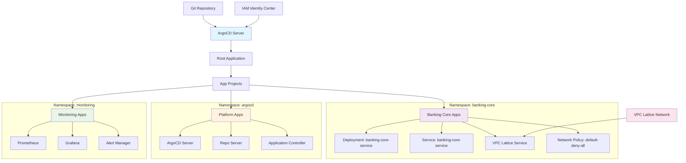
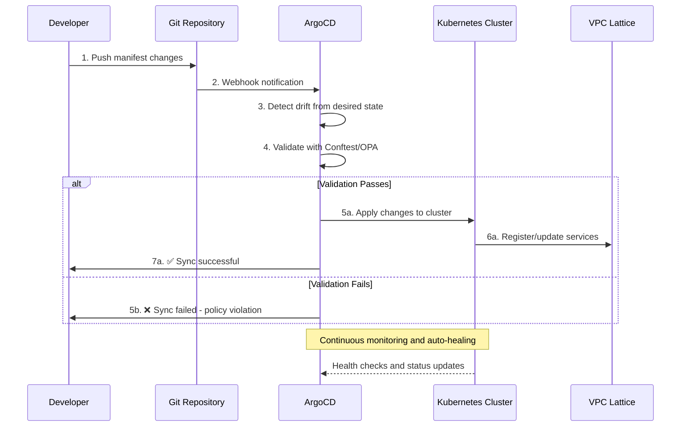

# Imladris GitOps - The State

ArgoCD-based GitOps platform for the Zero Trust Investment Banking environment.

## Overview

Imladris GitOps manages the desired state of all Kubernetes workloads using ArgoCD. It implements:

- **App-of-Apps Pattern**: Centralized application management
- **Zero Trust Networking**: Network policies and VPC Lattice integration
- **Policy Validation**: Built-in Conftest/OPA validation
- **Compliance Monitoring**: Continuous drift detection and remediation

## Cluster State Management



## Architecture Components

### Bootstrap Layer
- **Root Application**: App-of-apps that manages all other applications
- **App Projects**: RBAC and security boundaries for different teams
- **Repository Configuration**: Git repository access and credentials

### Tenant Layer
- **banking-core**: Core banking services namespace
- **platform**: Infrastructure and tooling namespace
- **monitoring**: Observability and alerting namespace

### Security Layer
- **Network Policies**: Default-deny with explicit allow rules
- **VPC Lattice Integration**: Service mesh for zero-trust communication
- **RBAC**: Fine-grained access control via IAM Identity Center

## App-of-Apps Pattern

The root application (`bootstrap/root.yaml`) manages all tenant applications:

1. **Discovery**: Automatically discovers applications in `tenants/` directory
2. **Deployment**: Creates Application resources for each tenant
3. **Synchronization**: Maintains desired state across all applications
4. **Health Monitoring**: Tracks health of all managed applications

## GitOps Workflow



## Tenant Onboarding

### 1. Create Namespace Structure

```bash
mkdir -p tenants/{tenant-name}
cd tenants/{tenant-name}
```

### 2. Define Base Resources

```yaml
# namespace.yaml
apiVersion: v1
kind: Namespace
metadata:
  name: {tenant-name}
  labels:
    name: {tenant-name}
    tier: application
    compliance: pci-dss
```

### 3. Application Manifests

```yaml
# deployment.yaml
apiVersion: apps/v1
kind: Deployment
metadata:
  name: {service-name}
  namespace: {tenant-name}
spec:
  # Your deployment configuration
```

### 4. VPC Lattice Integration

```yaml
# vpc-lattice-service.yaml
apiVersion: v1
kind: Service
metadata:
  name: {service-name}-lattice
  annotations:
    service.beta.kubernetes.io/aws-load-balancer-type: "external"
    service.beta.kubernetes.io/aws-load-balancer-scheme: "internal"
```

## Security Policies

### Network Policies
- **Default Deny**: All namespaces start with deny-all policies
- **Explicit Allow**: Only required communication paths are opened
- **VPC Lattice**: Service mesh traffic is automatically allowed
- **ArgoCD Access**: Management traffic from ArgoCD namespace

### Resource Policies (Conftest/OPA)
- **Security Context**: All pods must run as non-root
- **Resource Limits**: Memory and CPU limits required
- **Network Labels**: Proper labeling for service discovery
- **Image Security**: Only approved container registries

### RBAC Integration
- **IAM Identity Center**: SSO integration with AWS
- **Project-based Access**: Developers can only access their projects
- **Platform Admin**: Full cluster access for platform team
- **Read-only**: View-only access for auditors and management

## Monitoring and Observability

### Application Health
- **Sync Status**: ArgoCD tracks deployment status
- **Resource Health**: Kubernetes resource health checks
- **Policy Compliance**: Continuous policy validation
- **Drift Detection**: Automatic detection of configuration drift

### Service Mesh Metrics
- **VPC Lattice**: Service-to-service communication metrics
- **Network Policies**: Traffic flow monitoring
- **Security Events**: Policy violation alerts
- **Performance**: Latency and throughput metrics

## Usage

### Deploy New Application

1. **Create manifests** in `tenants/{namespace}/`
2. **Commit and push** to Git repository
3. **ArgoCD automatically detects** and deploys
4. **Monitor deployment** in ArgoCD UI

### Update Existing Application

1. **Modify manifests** in Git repository
2. **Push changes** to trigger sync
3. **ArgoCD validates** with policies
4. **Automatic rollout** if validation passes

### Rollback Application

```bash
# Via ArgoCD CLI
argocd app rollback {app-name} {revision-id}

# Via ArgoCD UI
# Navigate to application → History → Select revision → Rollback
```

### Emergency Procedures

```bash
# Suspend automatic sync (break glass)
argocd app patch {app-name} --patch '{"spec":{"syncPolicy":null}}'

# Manual sync with policy override (admin only)
argocd app sync {app-name} --force --replace

# Re-enable automatic sync
argocd app patch {app-name} --patch '{"spec":{"syncPolicy":{"automated":{"prune":true,"selfHeal":true}}}}'
```

## Integration Points

- **[imladris-platform](../imladris-platform)**: Infrastructure foundation
- **[imladris-governance](../imladris-governance)**: Policy validation
- **[imladris-service-template](../imladris-service-template)**: Application development
- **VPC Lattice**: Service mesh communication
- **AWS IAM Identity Center**: Authentication and authorization

---

**GitOps: The Single Source of Truth**
*Git is truth. Kubernetes is state. ArgoCD is the reconciler.*