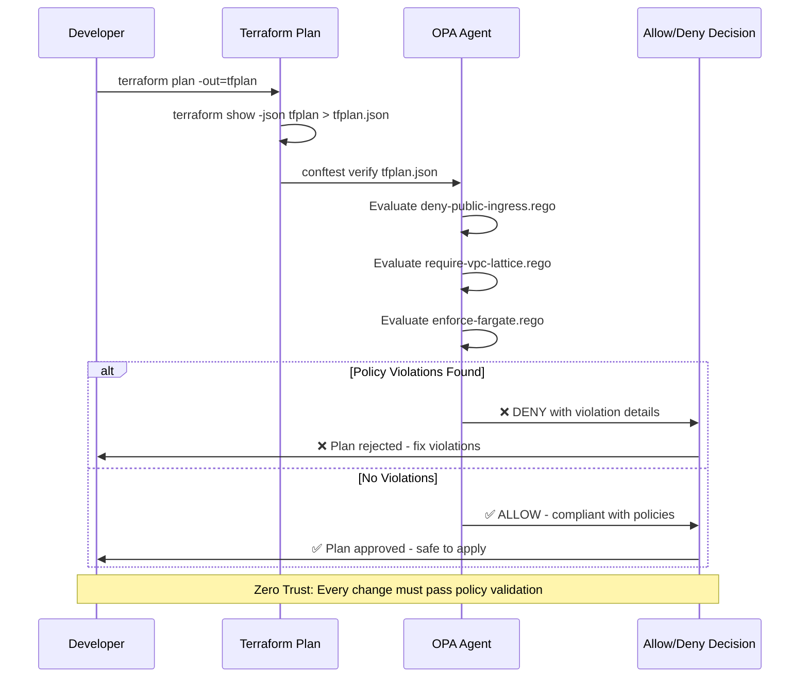

# Imladris Governance - The Law

Policy-as-Code definitions for the Zero Trust Investment Banking Platform.

## Overview

Imladris Governance enforces security and compliance policies through Open Policy Agent (OPA) and Conftest. These policies ensure:

- **Zero Public Access**: No security groups allow ingress from 0.0.0.0/0
- **VPC Lattice Only**: All service communication via VPC Lattice
- **Fargate Enforcement**: No EC2 instances, only Fargate
- **Encryption Standards**: All communication encrypted in transit

## Policy Enforcement Flow



## Policies

### 1. Deny Public Ingress (`deny-public-ingress.rego`)

Prevents any security group from allowing public access:

- **SSH (22)**: Blocked from 0.0.0.0/0
- **HTTP (80)**: Blocked from 0.0.0.0/0
- **HTTPS (443)**: Blocked except for VPC Lattice services
- **RDP (3389)**: Blocked from 0.0.0.0/0
- **All Ports (0-65535)**: Blocked from 0.0.0.0/0

### 2. Require VPC Lattice (`require-vpc-lattice.rego`)

Enforces VPC Lattice for service communication:

- **Service Network Association**: All VPC Lattice services must be in a service network
- **IAM Authentication**: All services must use `AWS_IAM` auth
- **HTTPS Only**: All listeners must use HTTPS for encryption
- **Internal Load Balancers**: Warns on public ALBs, suggests VPC Lattice

### 3. Enforce Fargate (`enforce-fargate.rego`)

Ensures immutable, serverless compute:

- **No EC2 Instances**: Blocks `aws_instance` resources
- **No EKS Node Groups**: Blocks `aws_eks_node_group` resources
- **No Auto Scaling Groups**: Blocks `aws_autoscaling_group` resources
- **Private Fargate Only**: Fargate profiles must use private subnets

## Usage

### 1. Install Tools

```bash
# Install Conftest
curl -L https://github.com/open-policy-agent/conftest/releases/latest/download/conftest_linux_x86_64.tar.gz | tar xz
sudo mv conftest /usr/local/bin

# Install OPA (optional, for testing)
curl -L https://github.com/open-policy-agent/opa/releases/latest/download/opa_linux_amd64 -o opa
chmod +x opa
sudo mv opa /usr/local/bin
```

### 2. Validate Terraform Plans

```bash
# In your Terraform directory
terraform plan -out=tfplan
terraform show -json tfplan > tfplan.json

# Run policy validation
conftest verify --policy ./policies tfplan.json
```

### 3. CI/CD Integration

```bash
# In your pipeline
terraform plan -out=tfplan -detailed-exitcode
terraform show -json tfplan > tfplan.json

# Policy check - fail on violations
conftest verify --policy ./imladris-governance/policies tfplan.json
if [ $? -ne 0 ]; then
  echo "❌ Policy violations found - plan rejected"
  exit 1
fi

echo "✅ Plan compliant - safe to apply"
terraform apply tfplan
```

## Policy Development

### Testing Policies

```bash
# Test individual policy
opa test policies/terraform/

# Test with sample Terraform plan
conftest verify --policy policies/ test-data/compliant-plan.json
conftest verify --policy policies/ test-data/violation-plan.json
```

### Policy Structure

```rego
package terraform.category

import rego.v1

# Deny rule (hard failure)
deny contains msg if {
    # condition logic
    msg := "VIOLATION: description"
}

# Warn rule (advisory)
warn contains msg if {
    # condition logic
    msg := "WARNING: description"
}
```

## Compliance Matrix

| Control | Policy | Description |
|---------|---------|-------------|
| **Network Security** | deny-public-ingress | No public inbound access |
| **Service Mesh** | require-vpc-lattice | All service communication via Lattice |
| **Compute Security** | enforce-fargate | No persistent compute, Fargate only |
| **Encryption** | require-vpc-lattice | HTTPS mandatory for all services |
| **Access Control** | require-vpc-lattice | IAM authentication required |

## Exceptions

Rare exceptions can be configured in `conftest.yaml` under the `exceptions` section. Use sparingly and document thoroughly:

```yaml
exceptions:
  - policy: "terraform.security.deny[_]"
    resources:
      - "aws_vpclattice_service.health_check"
    conditions:
      - "contains(message, 'health check')"
```

## Integration

These policies integrate with:
- **CI/CD Pipelines**: Automated plan validation
- **[imladris-platform](../imladris-platform)**: Infrastructure enforcement
- **GitOps**: Policy validation before merge
- **Developer Workflow**: Local validation before commit

---

**The Law of Zero Trust**
*Every change is validated. Every resource is compliant. Every violation is blocked.*