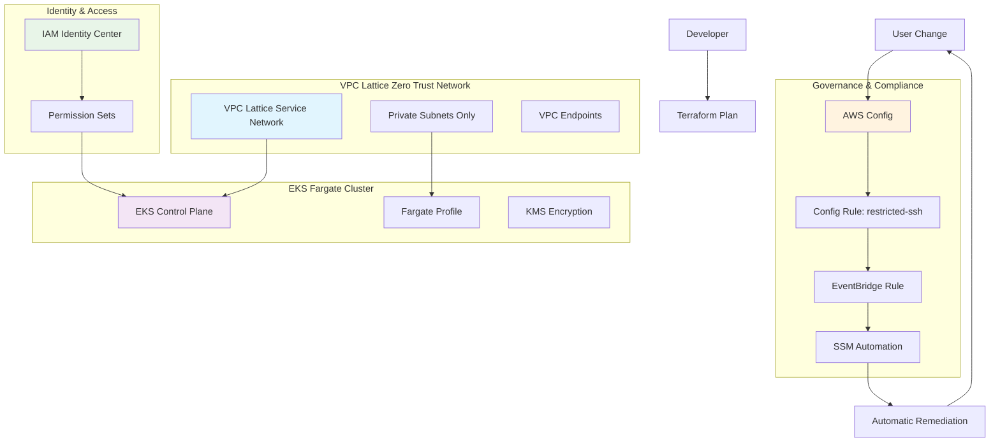

# Imladris Platform - The Foundation

The Zero Trust Infrastructure Platform for high-compliance fintech environments.

## Overview

Imladris Platform provides the foundational infrastructure for a completely private, self-healing, and compliant AWS environment:

- **Zero Trust Networking**: No VPNs, no public endpoints. All communication via VPC Lattice
- **Immutable Compute**: EKS Fargate only - no EC2 nodes to manage
- **Self-Healing Governance**: Automatic remediation of security violations
- **Identity-First**: AWS IAM Identity Center integration

## Architecture



## Self-Healing Infrastructure Flow

The platform implements a continuous compliance loop:

1. **Detection**: AWS Config monitors all resource changes
2. **Evaluation**: Config Rules evaluate compliance (e.g., no SSH from 0.0.0.0/0)
3. **Alert**: EventBridge captures non-compliant events
4. **Remediation**: SSM Automation automatically fixes violations
5. **Verification**: Config re-evaluates and confirms compliance

## Modules

### Networking Module
- **VPC**: Private-only network (10.0.0.0/16)
- **VPC Lattice**: Service mesh for zero-trust communication
- **VPC Endpoints**: Private access to AWS services
- **No Internet Gateway**: Zero external access

### Governance Module
- **AWS Config**: Continuous compliance monitoring
- **EventBridge**: Event-driven remediation triggers
- **SSM Automation**: Automatic violation fixes
- **Config Rules**: SSH restriction, public access prevention

### Compute Module
- **EKS Fargate**: Serverless Kubernetes containers
- **KMS Encryption**: Envelope encryption for secrets
- **IAM Identity Center**: Centralized access management
- **VPC Lattice Integration**: Service registration

## Usage

1. **Configure Variables**:
   ```bash
   cp terraform.tfvars.example terraform.tfvars
   # Edit terraform.tfvars with your values
   ```

2. **Deploy Infrastructure**:
   ```bash
   terraform init
   terraform plan
   terraform apply
   ```

3. **Verify Self-Healing**:
   ```bash
   # Create a non-compliant security group (SSH from 0.0.0.0/0)
   # Watch as AWS Config detects and SSM automatically remediates
   ```

## Compliance Features

- **No Public Access**: All resources are private-only
- **Encryption**: KMS encryption for EKS secrets
- **Audit Logging**: Comprehensive CloudWatch logs
- **Access Control**: IAM Identity Center with least privilege
- **Automated Remediation**: Self-healing security violations

## Zero Trust Principles

1. **Never Trust, Always Verify**: All service communication authenticated
2. **Least Privilege**: Minimal required access only
3. **Assume Breach**: Network segmentation via VPC Lattice
4. **Verify Explicitly**: Continuous compliance monitoring

## Next Steps

After deploying the platform:
1. Deploy [imladris-governance](../imladris-governance) policies
2. Configure [imladris-gitops](../imladris-gitops) for application deployment
3. Use [imladris-service-template](../imladris-service-template) for new services

---

**Built for Tier-1 Investment Banking**
*Security First. Compliance Always. Zero Trust Everything.*