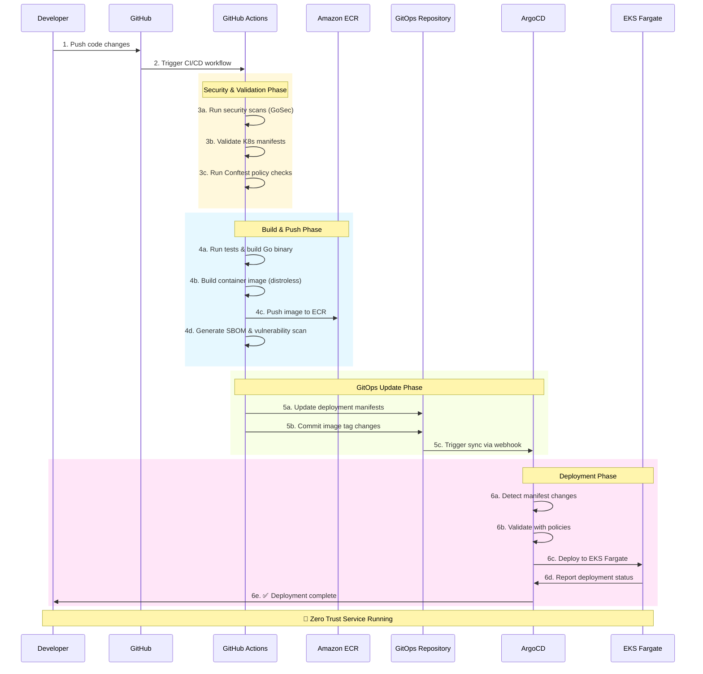

# Imladris Service Template - The Application

The "Golden Path" for developing Zero Trust banking services in the Imladris platform.

## Overview

This service template provides a production-ready foundation for developing microservices in the Imladris zero-trust banking environment:

- **Zero Trust Security**: Built-in security controls and compliance
- **VPC Lattice Ready**: Service mesh integration
- **GitOps Deployment**: Automated CI/CD via ArgoCD
- **Observability**: Prometheus metrics and structured logging
- **Container Security**: Distroless images and non-root execution

## Service Supply Chain



## Architecture

### Service Structure

```go
// main.go - Zero Trust HTTP Server
├── Health & Readiness Endpoints (/health, /ready)
├── Business Logic (/api/v1/accounts)
├── Prometheus Metrics (/metrics on port 9090)
├── Service Discovery (/.well-known/service)
└── Graceful Shutdown (SIGTERM handling)
```

### Security Features

- **Non-root Execution**: Runs as user ID 65534
- **Distroless Base Image**: No shell or package manager
- **Read-only Filesystem**: Prevents runtime modifications
- **Security Context**: Comprehensive pod security controls
- **Resource Limits**: CPU, memory, and storage constraints

### Observability

- **Structured Logging**: JSON format for log aggregation
- **Prometheus Metrics**: HTTP requests, business operations
- **Health Checks**: Kubernetes liveness, readiness, startup probes
- **Distributed Tracing**: Ready for OpenTelemetry integration

## Getting Started

### 1. Clone and Customize

```bash
# Clone the template
git clone https://github.com/your-org/imladris-service-template.git my-service
cd my-service

# Update Go module name
go mod edit -module github.com/your-org/my-service

# Update service configuration
export SERVICE_NAME="my-service"
export NAMESPACE="my-namespace"

# Find and replace template values
find . -name "*.yaml" -o -name "*.go" -o -name "*.yml" | \
  xargs sed -i "s/banking-core-service/$SERVICE_NAME/g"
```

### 2. Develop Locally

```bash
# Install dependencies
go mod download

# Run tests
go test -v ./...

# Run locally
export PORT=8080
export METRICS_PORT=9090
export LOG_LEVEL=debug
go run main.go
```

### 3. Test Endpoints

```bash
# Health check
curl http://localhost:8080/health

# Business endpoint
curl http://localhost:8080/api/v1/accounts?account_id=test-123

# Metrics
curl http://localhost:9090/metrics

# Service discovery
curl http://localhost:8080/.well-known/service
```

### 4. Container Testing

```bash
# Build container
docker build -t my-service:latest .

# Run container
docker run -p 8080:8080 -p 9090:9090 \
  -e ENVIRONMENT=dev \
  -e SERVICE_NAME=my-service \
  my-service:latest

# Security scan
docker run --rm -v $(pwd):/app \
  aquasec/trivy image my-service:latest
```

## CI/CD Pipeline

### Security Gates

1. **Code Security**: GoSec static analysis
2. **Container Security**: Trivy vulnerability scanning
3. **Policy Validation**: Conftest/OPA manifest validation
4. **SBOM Generation**: Software bill of materials
5. **Compliance Checks**: Banking regulation compliance

### Build Process

1. **Test Execution**: Unit tests with coverage reporting
2. **Binary Build**: Statically linked Go binary
3. **Container Build**: Multi-stage Docker build with distroless base
4. **Image Push**: Secure push to Amazon ECR
5. **Manifest Update**: GitOps repository update

### Deployment Flow

1. **GitOps Commit**: Updated manifests pushed to GitOps repo
2. **ArgoCD Sync**: Automatic deployment to EKS Fargate
3. **Health Verification**: Kubernetes health checks
4. **Service Registration**: VPC Lattice service mesh integration
5. **Monitoring Setup**: Prometheus scraping configuration

## Configuration

### Environment Variables

| Variable | Description | Default |
|----------|-------------|---------|
| `PORT` | HTTP server port | `8080` |
| `METRICS_PORT` | Metrics server port | `9090` |
| `LOG_LEVEL` | Logging level (debug, info, warn, error) | `info` |
| `LOG_FORMAT` | Log format (json, text) | `json` |
| `SERVICE_NAME` | Service identifier | `banking-core-service` |
| `ENVIRONMENT` | Deployment environment | `dev` |
| `AWS_REGION` | AWS region | `us-east-1` |

### Kubernetes Resources

```yaml
# Resource requests/limits
resources:
  limits:
    cpu: "500m"
    memory: "512Mi"
    ephemeral-storage: "1Gi"
  requests:
    cpu: "100m"
    memory: "128Mi"
    ephemeral-storage: "100Mi"
```

## VPC Lattice Integration

### Service Registration

The service automatically integrates with VPC Lattice through:

- **Service Annotations**: LoadBalancer annotations for VPC Lattice
- **Health Checks**: Kubernetes probes become Lattice health checks
- **IAM Authentication**: AWS IAM-based service-to-service auth
- **Service Discovery**: DNS-based service resolution

### Example Service Call

```go
// Call another service via VPC Lattice
client := &http.Client{}
req, _ := http.NewRequest("GET", "https://payments.imladris.prod.local/api/v1/status", nil)

// AWS Sigv4 signing for VPC Lattice
signer := v4.NewSigner()
signer.Sign(req, nil, "vpc-lattice", "us-east-1", time.Now())

resp, err := client.Do(req)
```

## Monitoring and Alerting

### Metrics

- `http_requests_total`: Total HTTP requests by method, endpoint, status
- `http_request_duration_seconds`: Request latency histogram
- `business_operations_total`: Business-specific operation counters

### Alerts

```yaml
# Example Prometheus alerts
groups:
- name: my-service
  rules:
  - alert: HighErrorRate
    expr: rate(http_requests_total{status_code=~"5.."}[5m]) > 0.1
    for: 5m
    annotations:
      summary: "High error rate detected"

  - alert: HighLatency
    expr: histogram_quantile(0.95, http_request_duration_seconds_bucket) > 0.5
    for: 5m
    annotations:
      summary: "High latency detected"
```

## Security Compliance

### Banking Regulations

- **PCI DSS**: No sensitive data logging, encrypted communications
- **SOX**: Audit trails, change management via GitOps
- **GDPR**: Data protection, right to erasure support
- **FFIEC**: Risk management, incident response procedures

### Zero Trust Controls

- **Identity Verification**: AWS IAM service-to-service authentication
- **Least Privilege**: Minimal container permissions
- **Encryption**: TLS for all communications via VPC Lattice
- **Monitoring**: Comprehensive logging and metrics
- **Policy Enforcement**: OPA/Conftest validation at build and runtime

## Troubleshooting

### Common Issues

```bash
# Container won't start
kubectl logs -f deployment/my-service -c my-service

# Health check failures
kubectl describe pod my-service-xxx

# VPC Lattice connectivity
aws vpc-lattice get-service --service-identifier my-service-id

# ArgoCD sync issues
argocd app get my-service --show-params
```

### Emergency Procedures

```bash
# Scale down service
kubectl scale deployment my-service --replicas=0

# Emergency rollback
argocd app rollback my-service $(argocd app history my-service -o id | tail -2 | head -1)

# Break glass deployment (bypass GitOps)
kubectl set image deployment/my-service my-service=image:previous-tag
```

## Integration Points

- **[imladris-platform](../imladris-platform)**: EKS cluster and VPC Lattice network
- **[imladris-governance](../imladris-governance)**: Policy validation during build
- **[imladris-gitops](../imladris-gitops)**: Deployment manifests and ArgoCD sync

---

**The Golden Path to Production**
*Secure by default. Compliant by design. Deployed with confidence.*